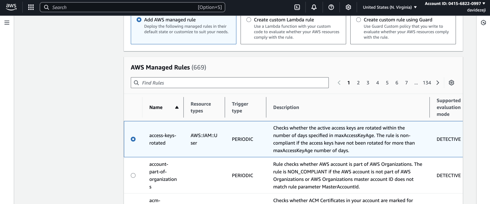
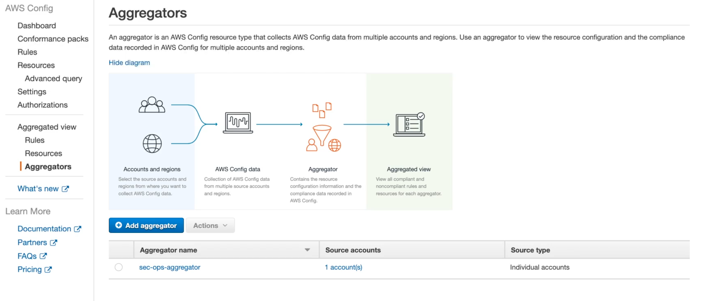
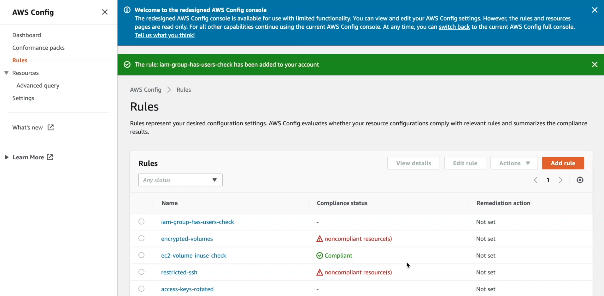
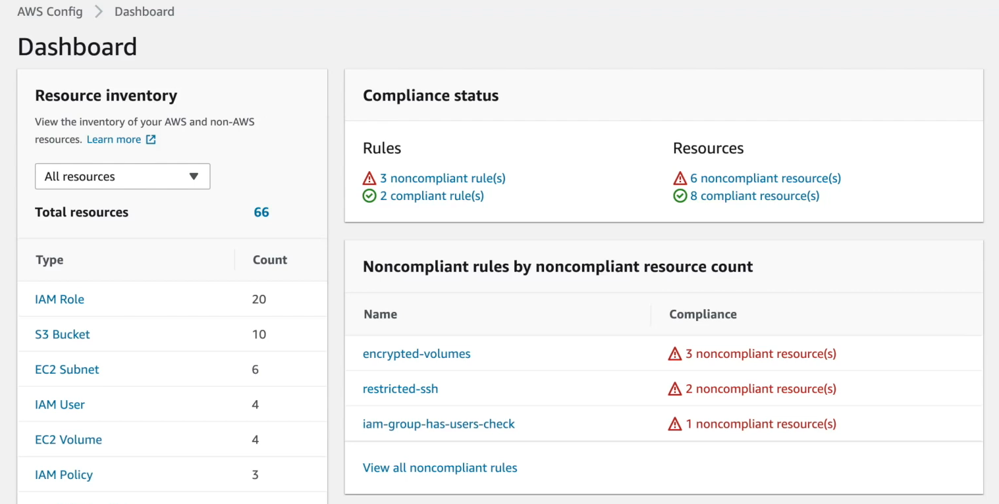
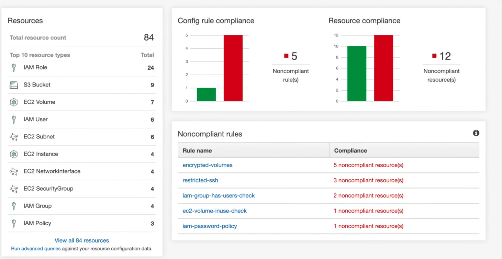

# AWS Security Projects
These projects demonstrate AWS security best practices, advanced data protection, AWS compliance controls using automation, proactive measures to defend against security threats and DDoS attacks.

Tech Stack:
- AWS Config
- AWS Security Hub
- AWS Trusted Advisor 
- AWS IAM 
- AWS CloudWatch 
- AWS CloudTrail 
- AWS Secrets Manager
- AWS GuardDuty 
- AWS WAF

## AWS Detective Control using AWS Config
**Overview:** Created two ec2 instances, one with public ports opened (e.g. port 22), and one with 5 ebs volumes attached (some encrypted vs. others that were non-encrypted). I then created config rules to monitor these resources and others created in the future.

Config rules:
- ec2 ports that are open to the public (mark them as “NONCOMPLIANT” )

- EBS volumes are encrypted for all instances across AWS account

- EBS volumes are correctly attached to instances

- Check to see if access keys are older as 90 days (make them as “NONCOMPLIANT”)

- IAM groups have at least one IAM user

- Created an AWS config aggregator to ensure that I can use these same config rules to also monitor resources in another aws account 

Outcome:
- After creating my resources and config rules, 6 resources were marked as noncompliant in my main account.

- In the aggregated dashboard I see a few more noncompliant resources

AWS Config Remediation