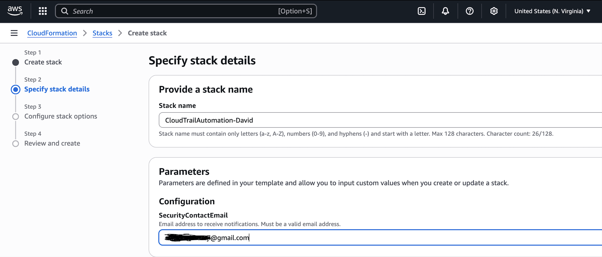
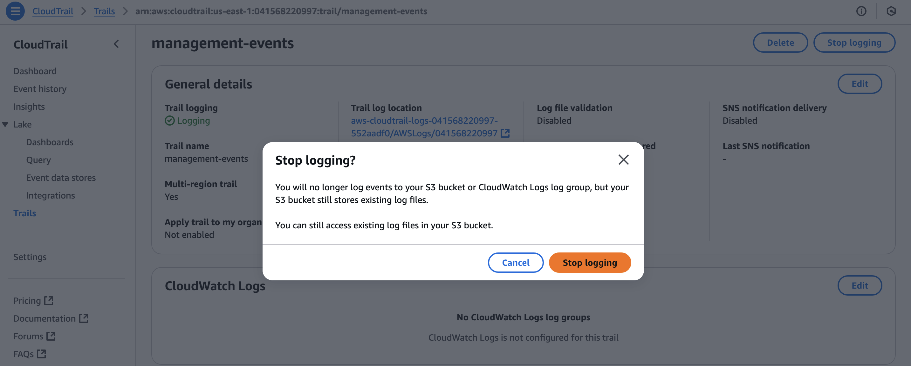
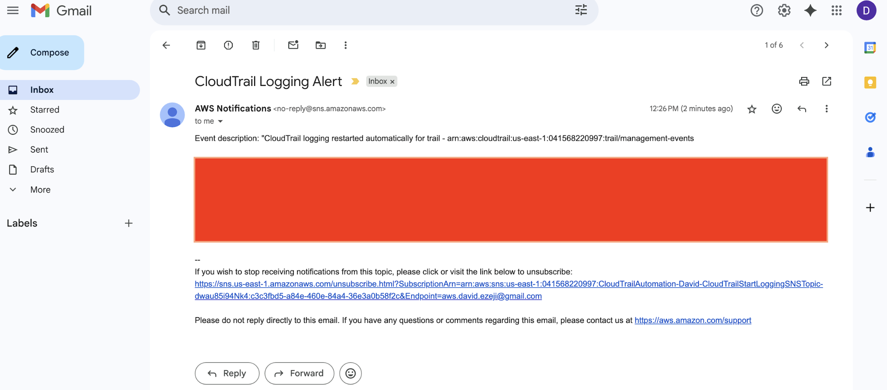
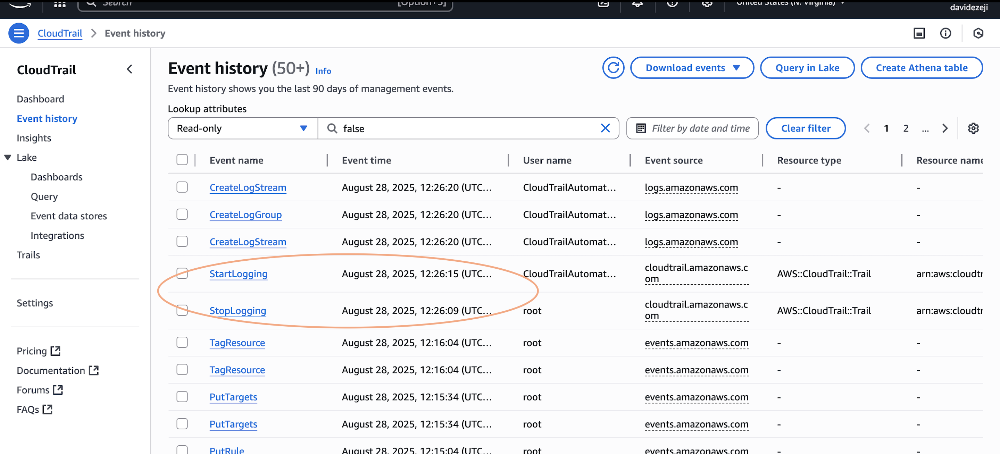
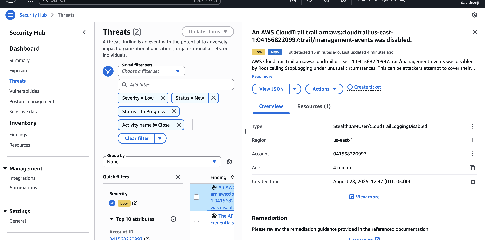

# AWS CloudTrail

**Scenario:** A malicious actor tries to disable CloudTrail in an AWS account to cover their tracks of malicious activity.

**Goal:** Create a cloudwatch events rule that identifies the attempt to disable CloudTrail, this then creates an SNS topic that alerts the security team and use the same event to trigger a lambda function that re-enables CloudTrail logging ensuring that this service is never be permanently disabled. The setup for this project can be found/deployed using the cloudformation template in this directory called "cloudtrail-auto-remediation.template".

**Prerequisites:**
- Enable CloudTrail in your account(s) (create a trail if you don't have one)
- Enable GuardDuty in your account(s)
- Enable SecurityHub in your account(s)

**Cloudtrail-auto-remediation Cloudformation Script Breakdown:**

What the stack actually does:
- Creates two Lambda functions that can:
    - Detect when CloudTrail logging is stopped (via EventBridge rule or Security Hub finding).
    - Call StartLogging to turn it back on.
    - Send an SNS email notification to your SecurityContactEmail.
- Creates an IAM role with permissions (cloudtrail:StartLogging, cloudtrail:GetTrailStatus, sns:Publish).
- Creates EventBridge rules that trigger the remediation Lambda:
    - CloudWatch Events (CWE) → when a StopLogging, DeleteTrail, UpdateTrail, etc. API call happens.
    - Security Hub (SH) → when a specific finding is imported into Security Hub.
- Creates an SNS topic with your provided email as a subscriber.

## Steps
1. Upload cloudformation stack in AWS account

**Note: when getting ready to deploy the CloudFormation stack make sure to enter in the email of your security team when prompted 

2. Make sure to subscribe to the SNS topic notifications via an initial email that is sent out

3. Try to disable your CloudTrail by stopping its logging mechanism 

4. After one minute the lambda function should trigger an email notifying you about the action that has occurred and that logging has been re-enabled (resulting from the other lambda function)

5. You can also confirm the action of cloudtrail logging being stopped, and all the metadata associated with that event in both GuardDuty and SecurityHub

GuardDuty:

SecurityHub:
